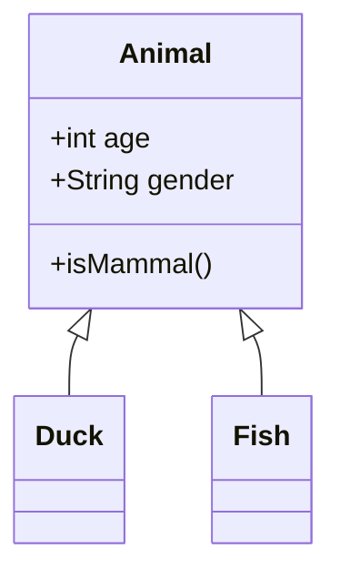
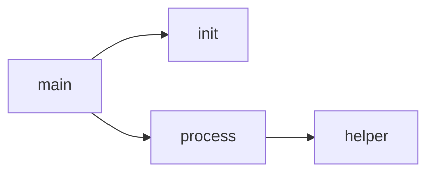
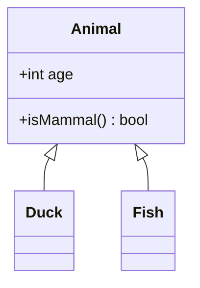
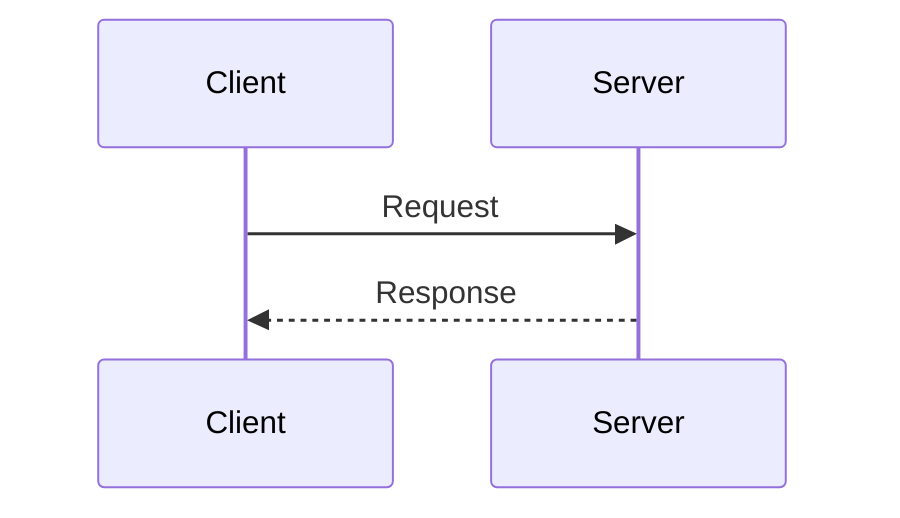

# Product Requirements Document: Mermaid Diagram Support for Doxygen

**Version:** 1.0
**Date:** January 2026
**Author:** Claude Code

---

## 1. Executive Summary

This PRD outlines the implementation of native Mermaid diagram support in Doxygen, providing two major capabilities:

1. **Inline Mermaid Diagrams**: User-authored mermaid code blocks rendered as images (similar to PlantUML)
2. **Mermaid as Auto-Generated Diagram Backend**: Replacing or supplementing Graphviz/DOT for call graphs, inheritance diagrams, etc.
3. **Raw Mermaid Output for Markdown**: Option to embed raw mermaid syntax in output (for AI-readable documentation)

---

## 2. Background & Motivation

### 2.1 Current State

- **PlantUML Support**: Doxygen has mature PlantUML integration via `@startuml`/`@enduml` commands
- **Graphviz/DOT**: All auto-generated diagrams use DOT language and the `dot` tool
- **No Mermaid Support**: Users resort to workarounds (JS injection, filter scripts, Base64 encoding)

### 2.2 Community Demand

- **PR #8684** (2021): Attempted mermaid support, went stale due to:
  - Hardcoded mmdc path (should be configurable like PlantUML)
  - Outdated caching mechanism
  - Missing documentation

- **Issue #10992**: Ongoing discussion showing demand, maintainer acknowledges "an approach similar to PlantUML could be used"

### 2.3 Why Mermaid?

| Feature | Graphviz | PlantUML | Mermaid |
|---------|----------|----------|---------|
| Web-native rendering | No | No | Yes (JS library) |
| CLI tool available | Yes (dot) | Yes (plantuml.jar) | Yes (mmdc) |
| GitHub/GitLab native | No | No | Yes |
| Human-readable syntax | Medium | High | Very High |
| AI-friendly for parsing | No | Medium | Yes |
| Learning curve | Steep | Medium | Low |

---

## 3. Feature Requirements

### 3.1 Feature 1: Inline Mermaid Diagrams

**Description**: Allow users to embed mermaid diagrams in documentation comments

**Syntax**:
```cpp
/**
 * @startmermaid{flowchart}
 * graph TD
 *     A[Start] --> B{Is it?}
 *     B -->|Yes| C[OK]
 *     B -->|No| D[End]
 * @endmermaid
 */
```

**Alternative Syntax** (Markdown-style):
```markdown
```{mermaid}
graph TD
    A --> B
```
```

**Configuration Options**:

| Option | Type | Default | Description |
|--------|------|---------|-------------|
| `MERMAID_EXECUTABLE` | string | `mmdc` | Path to mermaid-cli executable |
| `MERMAID_CONFIG_FILE` | string | `` | Optional puppeteer/mermaid config JSON |
| `MERMAID_FORMAT` | enum | `svg` | Output format: `svg`, `png`, `pdf` |
| `MERMAIDFILE_DIRS` | list | `` | Directories containing `.mmd` files |

**Output Formats**:
- **HTML**: `` or inline `<svg>` or `<div class="mermaid">` for client-side
- **LaTeX**: PNG/PDF inclusion
- **DocBook**: `<mediaobject>` with image
- **Markdown (new)**: Raw mermaid code block

---

### 3.2 Feature 2: Mermaid Files Command

**Description**: Include external `.mmd` files

**Syntax**:
```cpp
/**
 * See the architecture diagram:
 * @mermaidfile architecture.mmd
 * @mermaidfile "path with spaces/diagram.mmd" "Caption text" width=500
 */
```

**Behavior**: Mirrors `@plantumlfile` and `@dotfile` commands

---

### 3.3 Feature 3: Mermaid as Auto-Generated Diagram Backend

**Description**: Use Mermaid instead of Graphviz for auto-generated diagrams

**Supported Diagram Types**:

| Diagram Type | Graphviz | Mermaid Equivalent |
|--------------|----------|-------------------|
| Class Inheritance | DOT digraph | `classDiagram` |
| Collaboration Diagram | DOT digraph | `classDiagram` |
| Call Graph | DOT digraph | `flowchart LR` |
| Caller Graph | DOT digraph | `flowchart RL` |
| Include Dependency | DOT digraph | `flowchart TD` |
| Directory Dependency | DOT digraph | `flowchart TD` |
| Group Collaboration | DOT digraph | `flowchart TD` |

**Configuration Options**:

| Option | Type | Default | Description |
|--------|------|---------|-------------|
| `USE_MERMAID` | bool | `NO` | Master switch for Mermaid backend |
| `MERMAID_THEME` | enum | `default` | Mermaid theme: `default`, `dark`, `forest`, `neutral` |
| `MERMAID_CLIENT_SIDE` | bool | `NO` | Embed raw mermaid in HTML for client-side rendering |

**Behavioral Logic**:
```
IF USE_MERMAID = YES:
    Use mermaid for auto-generated diagrams
    IF MERMAID_CLIENT_SIDE = YES:
        Embed raw mermaid in HTML <div class="mermaid">
    ELSE:
        Invoke mmdc to generate SVG/PNG
ELSE IF HAVE_DOT = YES:
    Use Graphviz (current behavior)
ELSE:
    No graphical diagrams (text fallback)
```

---

### 3.4 Feature 4: Raw Mermaid Output Mode

**Description**: For AI-readable documentation, output raw mermaid syntax instead of images

**Configuration**:

| Option | Type | Default | Description |
|--------|------|---------|-------------|
| `MERMAID_OUTPUT_RAW` | bool | `NO` | Output raw mermaid text instead of images |

**Use Case**: AI tools can parse mermaid syntax to understand code structure

**Output Example** (Markdown):
```markdown
## Class Hierarchy


```

---

## 4. Technical Architecture

### 4.1 New Files to Create

| File | Purpose |
|------|---------|
| `src/mermaid.h` | MermaidManager singleton class |
| `src/mermaid.cpp` | Mermaid CLI invocation, caching |
| `src/mermaidgraph.h` | Base class for Mermaid diagram generation |
| `src/mermaidgraph.cpp` | Mermaid syntax generation |
| `src/mermaidnode.h` | Node/edge representation for Mermaid |
| `src/mermaidnode.cpp` | Mermaid node formatting |

### 4.2 Files to Modify

| File | Modification |
|------|--------------|
| `src/config.xml` | Add MERMAID_* configuration options |
| `src/configimpl.l` | Validate MERMAID_EXECUTABLE path |
| `src/markdown.cpp` | Add mermaid block command detection |
| `src/docnode.h` | Add DocMermaidFile class, extend DocVerbatim |
| `src/docnode.cpp` | Parse @startmermaid/@endmermaid, @mermaidfile |
| `src/htmldocvisitor.cpp` | Render mermaid to HTML |
| `src/latexdocvisitor.cpp` | Render mermaid to LaTeX |
| `src/docbookvisitor.cpp` | Render mermaid to DocBook |
| `src/rtfdocvisitor.cpp` | Render mermaid to RTF |
| `src/dotgraph.h` | Add renderer abstraction or mermaid output mode |
| `src/dotgraph.cpp` | Support mermaid output generation |
| `src/dotnode.h/.cpp` | Add mermaid formatter methods |
| `src/dotcallgraph.cpp` | Add mermaid call graph generation |
| `src/dotclassgraph.cpp` | Add mermaid class diagram generation |

### 4.3 Architecture Patterns

#### 4.3.1 MermaidManager (Singleton Pattern)

```cpp
// src/mermaid.h
class MermaidManager {
public:
    enum OutputFormat { MMD_SVG, MMD_PNG, MMD_PDF, MMD_RAW };

    static MermaidManager &instance();

    // Write mermaid source and return base filename
    StringVector writeMermaidSource(
        const QCString &outDir,
        const QCString &fileName,
        const QCString &content,
        OutputFormat format,
        const QCString &srcFile,
        int srcLine,
        bool inlineCode
    );

    // Generate output via mmdc
    void generateMermaidOutput(
        const QCString &baseName,
        const QCString &outDir,
        OutputFormat format
    );

    // Batch process all pending diagrams
    void run();

private:
    // Caching maps similar to PlantumlManager
    FilesMap m_svgFiles;
    FilesMap m_pngFiles;
    ContentMap m_svgContent;
    ContentMap m_pngContent;
};
```

#### 4.3.2 Graph Renderer Abstraction

```cpp
// src/graphrenderer.h (new abstraction)
class GraphRenderer {
public:
    virtual ~GraphRenderer() = default;

    virtual void writeGraphHeader(TextStream &t, const QCString &title) = 0;
    virtual void writeNode(TextStream &t, const DotNode &node) = 0;
    virtual void writeEdge(TextStream &t, const DotNode &from, const DotNode &to,
                          const EdgeInfo &info) = 0;
    virtual void writeGraphFooter(TextStream &t) = 0;
    virtual QCString fileExtension() const = 0;
};

class DotRenderer : public GraphRenderer { /* existing DOT output */ };
class MermaidRenderer : public GraphRenderer { /* new Mermaid output */ };
```

#### 4.3.3 Diagram Type Mapping

```cpp
// Mermaid syntax for different diagram types
namespace MermaidSyntax {
    // Class/Inheritance diagram
    const char* CLASS_HEADER = "classDiagram\n";
    const char* INHERITANCE_ARROW = " <|-- ";  // Child inherits Parent
    const char* COMPOSITION_ARROW = " *-- ";   // Composition
    const char* AGGREGATION_ARROW = " o-- ";   // Aggregation
    const char* ASSOCIATION_ARROW = " --> ";   // Association

    // Flowchart/Call graph
    const char* FLOWCHART_LR = "flowchart LR\n";  // Left to Right
    const char* FLOWCHART_TD = "flowchart TD\n";  // Top Down
    const char* FLOW_ARROW = " --> ";
    const char* FLOW_ARROW_LABEL = " -->|%s| ";   // With label
}
```

### 4.4 mmdc CLI Integration

**Command Line Pattern**:
```bash
mmdc -i input.mmd -o output.svg -t default -c config.json
```

**Execution Code**:
```cpp
void runMermaidContent(const QCString &outDir,
                       const StringVector &files,
                       MermaidManager::OutputFormat format) {
    QCString mermaidExe = Config_getString(MERMAID_EXECUTABLE);
    QCString mermaidConfig = Config_getString(MERMAID_CONFIG_FILE);
    QCString theme = Config_getString(MERMAID_THEME);

    for (const auto &file : files) {
        QCString args;
        args += "-i \"" + file + "\" ";
        args += "-o \"" + outputPath + "\" ";
        args += "-t " + theme + " ";
        if (!mermaidConfig.isEmpty()) {
            args += "-c \"" + mermaidConfig + "\" ";
        }

        int exitCode = Portable::system(mermaidExe, args, false);
        if (exitCode != 0) {
            err("Mermaid failed for %s\n", file.c_str());
        }
    }
}
```

---

## 5. Configuration Schema

### 5.1 config.xml Additions

```xml
<!-- Mermaid Configuration Section -->
<option type='string' id='MERMAID_EXECUTABLE' format='file' defval=''>
  <docs>
<![CDATA[
When using Mermaid diagrams, the \c MERMAID_EXECUTABLE tag should specify
the path to the mermaid-cli tool (mmdc). If left blank, Doxygen will
attempt to find mmdc in the system PATH. If not found, @startmermaid
commands will generate warnings and no output.
]]>
  </docs>
</option>

<option type='string' id='MERMAID_CONFIG_FILE' format='file' defval=''>
  <docs>
<![CDATA[
Optional JSON configuration file for the Mermaid CLI tool. This can
specify puppeteer configuration and mermaid options.
]]>
  </docs>
</option>

<option type='enum' id='MERMAID_FORMAT' defval='svg'>
  <docs>
<![CDATA[
The output format for Mermaid diagrams. SVG is recommended for HTML output.
]]>
  </docs>
  <value name='svg'/>
  <value name='png'/>
  <value name='pdf'/>
</option>

<option type='enum' id='MERMAID_THEME' defval='default'>
  <docs>
<![CDATA[
The theme to use for Mermaid diagrams.
]]>
  </docs>
  <value name='default'/>
  <value name='dark'/>
  <value name='forest'/>
  <value name='neutral'/>
</option>

<option type='list' id='MERMAIDFILE_DIRS' format='dir'>
  <docs>
<![CDATA[
The \c MERMAIDFILE_DIRS tag can be used to specify one or more directories
that contain Mermaid files (.mmd) that are included in the documentation
(see the \ref cmdmermaidfile "\\mermaidfile" command).
]]>
  </docs>
</option>

<option type='bool' id='USE_MERMAID' defval='0'>
  <docs>
<![CDATA[
If \c USE_MERMAID is set to \c YES, Doxygen will use Mermaid instead of
Graphviz for auto-generated diagrams (class graphs, call graphs, etc.).
This requires MERMAID_EXECUTABLE to be configured.
]]>
  </docs>
</option>

<option type='bool' id='MERMAID_CLIENT_SIDE' defval='0' depends='USE_MERMAID'>
  <docs>
<![CDATA[
If \c MERMAID_CLIENT_SIDE is set to \c YES, Doxygen will embed raw Mermaid
diagram definitions in HTML output, to be rendered client-side by the
Mermaid.js library. This is only used when USE_MERMAID is enabled.
When disabled, diagrams are pre-rendered to SVG/PNG using the mmdc CLI.
]]>
  </docs>
</option>

<option type='bool' id='MERMAID_OUTPUT_RAW' defval='0'>
  <docs>
<![CDATA[
If \c MERMAID_OUTPUT_RAW is set to \c YES, Doxygen will output raw Mermaid
syntax in markdown code blocks instead of rendering to images. This is
useful for AI-readable documentation where the diagram syntax itself
provides valuable structural information.
]]>
  </docs>
</option>
```

---

## 6. Command Syntax Specification

### 6.1 @startmermaid / @endmermaid

```
@startmermaid{diagram_type,"filename"} width=NNN height=NNN
<mermaid diagram content>
@endmermaid
```

**Parameters**:
- `diagram_type`: Optional. One of: `flowchart`, `sequenceDiagram`, `classDiagram`, `stateDiagram`, `erDiagram`, `gantt`, `pie`, `mindmap`
- `filename`: Optional. Custom output filename (without extension)
- `width`: Optional. Image width in pixels
- `height`: Optional. Image height in pixels

### 6.2 @mermaidfile

```
@mermaidfile <filename> ["caption"] [width=NNN] [height=NNN]
```

### 6.3 Code Fence Syntax (Markdown)

````markdown

````

Or with Doxygen attributes:

````markdown
```{.mermaid width=400}
graph TD
    A --> B
```
````

---

## 7. Implementation Phases

### Phase 1: Core Infrastructure

**Deliverables**:
1. Configuration options in config.xml
2. MermaidManager singleton class
3. mmdc CLI execution infrastructure
4. MD5-based caching (matching PlantUML approach)

**Estimated Scope**: ~800 lines of new code

**Files**:
- New: `src/mermaid.h`, `src/mermaid.cpp`
- Modified: `src/config.xml`, `src/configimpl.l`

### Phase 2: Inline Mermaid Commands

**Deliverables**:
1. @startmermaid/@endmermaid command parsing
2. DocVerbatim Mermaid type
3. HTML output visitor implementation
4. LaTeX output visitor implementation

**Estimated Scope**: ~600 lines of new/modified code

**Files**:
- Modified: `src/markdown.cpp`, `src/docnode.h`, `src/docnode.cpp`
- Modified: `src/htmldocvisitor.cpp`, `src/latexdocvisitor.cpp`

### Phase 3: Mermaid File Command

**Deliverables**:
1. @mermaidfile command parsing
2. DocMermaidFile class
3. File search in MERMAIDFILE_DIRS

**Estimated Scope**: ~300 lines of new/modified code

**Files**:
- Modified: `src/docnode.h`, `src/docnode.cpp`
- Modified: All doc visitors

### Phase 4: Auto-Generated Diagrams

**Deliverables**:
1. Mermaid renderer abstraction
2. Class diagram generation (inheritance, collaboration)
3. Call graph generation
4. Include/directory dependency generation

**Estimated Scope**: ~2000 lines of new/modified code

**Files**:
- New: `src/mermaidgraph.h`, `src/mermaidgraph.cpp`
- New: `src/mermaidnode.h`, `src/mermaidnode.cpp`
- Modified: `src/dotgraph.h`, `src/dotgraph.cpp`
- Modified: `src/dotclassgraph.cpp`, `src/dotcallgraph.cpp`
- Modified: `src/dotincldepgraph.cpp`, `src/dotdirdeps.cpp`

### Phase 5: Client-Side & Raw Output

**Deliverables**:
1. Client-side mermaid.js embedding in HTML
2. Raw mermaid output for markdown/XML
3. Include mermaid.js in generated HTML (or CDN link)

**Estimated Scope**: ~400 lines of new/modified code

**Files**:
- Modified: `src/htmlgen.cpp`, `src/htmlgen.h`
- Modified: `src/resourcemgr.cpp` (embed mermaid.js)

---

## 8. Testing Strategy

### 8.1 Unit Tests

| Test | Description |
|------|-------------|
| `mermaid_inline_basic` | Basic @startmermaid/@endmermaid |
| `mermaid_inline_types` | All diagram types (flowchart, class, etc.) |
| `mermaid_file_include` | @mermaidfile command |
| `mermaid_config_validation` | Config option validation |
| `mermaid_caching` | MD5-based regeneration |

### 8.2 Integration Tests

| Test | Description |
|------|-------------|
| `mermaid_class_graph` | Auto-generated class inheritance |
| `mermaid_call_graph` | Auto-generated call graphs |
| `mermaid_html_output` | Complete HTML generation |
| `mermaid_latex_output` | Complete LaTeX generation |
| `mermaid_client_side` | JavaScript embedding |

### 8.3 Test File Structure

```
testing/
├── 100_mermaid_basic/
│   ├── Doxyfile
│   ├── input.cpp
│   └── expected/
├── 101_mermaid_types/
├── 102_mermaid_file/
├── 103_mermaid_class_graph/
├── 104_mermaid_call_graph/
└── 105_mermaid_client_side/
```

---

## 9. Documentation Requirements

### 9.1 Manual Updates

- Add "Mermaid Support" section to manual
- Document all configuration options
- Add @startmermaid/@endmermaid command reference
- Add @mermaidfile command reference
- Provide migration guide from Graphviz

### 9.2 Example Files

Create example documentation demonstrating:
- Basic flowchart diagram
- Class diagram
- Sequence diagram
- Auto-generated diagrams with USE_MERMAID

---

## 10. Compatibility & Migration

### 10.1 Backwards Compatibility

- All existing Graphviz functionality preserved
- USE_MERMAID defaults to NO
- Mermaid is opt-in, not replacement

### 10.2 Migration Path

Users wanting Mermaid can:
1. Install mmdc (`npm install -g @mermaid-js/mermaid-cli`)
2. Set `USE_MERMAID = YES` in Doxyfile
3. Optionally set `MERMAID_CLIENT_SIDE = YES` for web-native rendering

---

## 11. Dependencies

### 11.1 External Dependencies

| Dependency | Required For | Installation |
|------------|--------------|--------------|
| mermaid-cli (mmdc) | All Mermaid rendering | `npm install -g @mermaid-js/mermaid-cli` |
| Node.js | mmdc runtime | System package manager |
| Puppeteer | mmdc PNG/PDF output | Installed with mmdc |

### 11.2 Platform Support

| Platform | Support Level |
|----------|---------------|
| Linux | Full (mmdc via npm) |
| macOS | Full (mmdc via npm) |
| Windows | Full (mmdc via npm, needs Node.js) |

---

## 12. Risks & Mitigations

| Risk | Impact | Mitigation |
|------|--------|------------|
| mmdc not installed | Diagrams fail | Clear error messages, fallback to text |
| mmdc version incompatibility | Rendering issues | Document supported versions |
| Puppeteer/Chrome issues | PNG/PDF generation fails | Recommend SVG output |
| Performance with many diagrams | Slow builds | Parallel execution, caching |
| Mermaid syntax limitations | Can't represent all DOT features | Document limitations, allow DOT fallback |

---

## 13. Success Criteria

1. **Functional**: All inline mermaid diagrams render correctly
2. **Functional**: Auto-generated diagrams match DOT quality/information
3. **Performance**: Build time increase <20% vs Graphviz
4. **Adoption**: Configuration is intuitive (mirrors PlantUML)
5. **Upstream**: PR structured for maintainer acceptance

---

## 14. Open Questions

1. **Should mermaid.js be bundled or CDN-linked for client-side rendering?**
   - Bundling increases package size but ensures offline availability
   - CDN reduces size but requires internet access

2. **Should we support mermaid syntax validation before rendering?**
   - Could catch errors earlier but adds complexity

3. **How to handle DOT features not available in Mermaid?**
   - Some edge styles, colors may not translate perfectly

4. **Should MERMAID_EXECUTABLE auto-detect mmdc in PATH?**
   - PlantUML requires explicit path; should we be more lenient?

---

## Appendix A: Mermaid Syntax Quick Reference

### Flowchart (Call Graphs)


### Class Diagram (Inheritance)


### Sequence Diagram


---

## Appendix B: DOT to Mermaid Mapping

### Node Styles
| DOT | Mermaid |
|-----|---------|
| `shape=box` | `[text]` |
| `shape=ellipse` | `([text])` |
| `shape=diamond` | `{text}` |
| `shape=parallelogram` | `[/text/]` |

### Edge Styles
| DOT | Mermaid |
|-----|---------|
| `style=solid` | `-->` |
| `style=dashed` | `-.->` |
| `style=dotted` | `-.->` |
| `arrowhead=empty` | `--o` |
| `arrowhead=diamond` | `--*` |

### Colors (via CSS classes in Mermaid)
| DOT Color | Mermaid Theme Equivalent |
|-----------|-------------------------|
| `steelblue1` | Primary color |
| `green` | Success color |
| `red` | Danger color |
